# Project 1: Monitoring & Alerting Stack

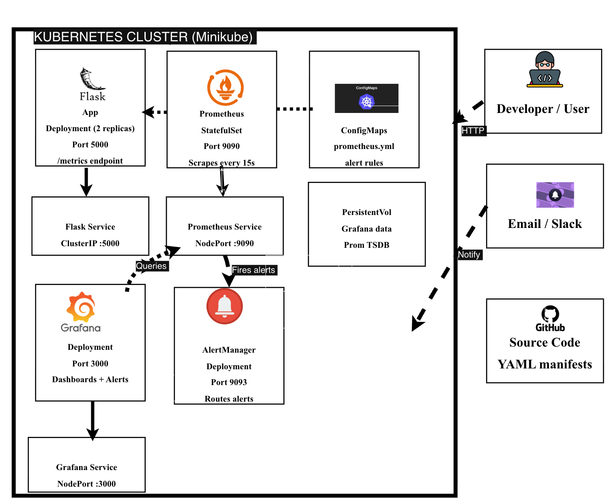

## Problem Statement

Production applications with no observability leave engineering teams blind to failures.
Incidents get discovered by users before engineers. This project builds a complete
monitoring and alerting pipeline using Prometheus, Grafana, and AlertManager on
Kubernetes — so teams detect and respond to incidents before users are impacted.

## Tech Stack

| Tool | Purpose |
|------|---------|
| Flask | Sample application exposing /metrics endpoint |
| Docker | Containerize the Flask application |
| Kubernetes (minikube) | Container orchestration |
| Prometheus | Metrics scraping and storage |
| Grafana | Metrics visualization and dashboards |
| AlertManager | Alert routing and notifications |
| Helm | Kubernetes package manager |

## Prerequisites

| Tool | Version Used |
|------|-------------|
| Docker Desktop | 28.0.4 |
| minikube | v1.38.1 |
| kubectl | v1.36.0 |
| Helm | v4.1.4 |

---

## Step 1 — Start Your Kubernetes Cluster

Start minikube with enough memory and CPU to run the full monitoring stack:

\`\`\`bash
minikube start --memory=4096 --cpus=2 --driver=docker
minikube status
kubectl get nodes
\`\`\`

Expected output:

\`\`\`
NAME       STATUS   ROLES           AGE   VERSION
minikube   Ready    control-plane   2m    v1.35.1
\`\`\`

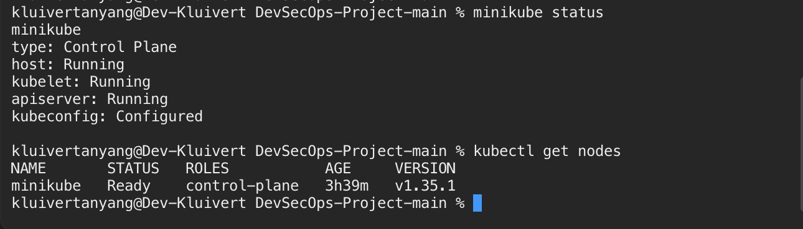

---

## Step 2 — Clone This Repository

\`\`\`bash
git clone https://github.com/Kluivertanyang/devops-monitoring-prometheus-grafana.git
cd devops-monitoring-prometheus-grafana
\`\`\`

---

## Step 3 — The Flask Application

The Flask app exposes a /metrics endpoint using prometheus-flask-exporter.
Prometheus scrapes this endpoint every 15 seconds. The app includes these routes:

- / — returns app health status
- /api/data — simulates variable response times to generate interesting metrics
- /api/error — randomly returns 500 errors to trigger AlertManager alerts
- /health — used by Kubernetes liveness and readiness probes
- /metrics — scraped by Prometheus automatically

---

## Step 4 — Build and Push the Docker Image

The Dockerfile uses a non-root user for security and layer caching for faster builds.

\`\`\`bash
docker build -t kluivertanyang/flask-monitor-app:v1.0 ./app
docker push kluivertanyang/flask-monitor-app:v1.0
\`\`\`

Test the app runs correctly before deploying to Kubernetes:

\`\`\`bash
docker run -p 5001:5000 kluivertanyang/flask-monitor-app:v1.0
\`\`\`

Visit http://localhost:5001 — expected response:

\`\`\`json
{"service": "flask-monitor-app", "status": "healthy"}
\`\`\`

Visit http://localhost:5001/metrics to confirm Prometheus metrics are exposed.

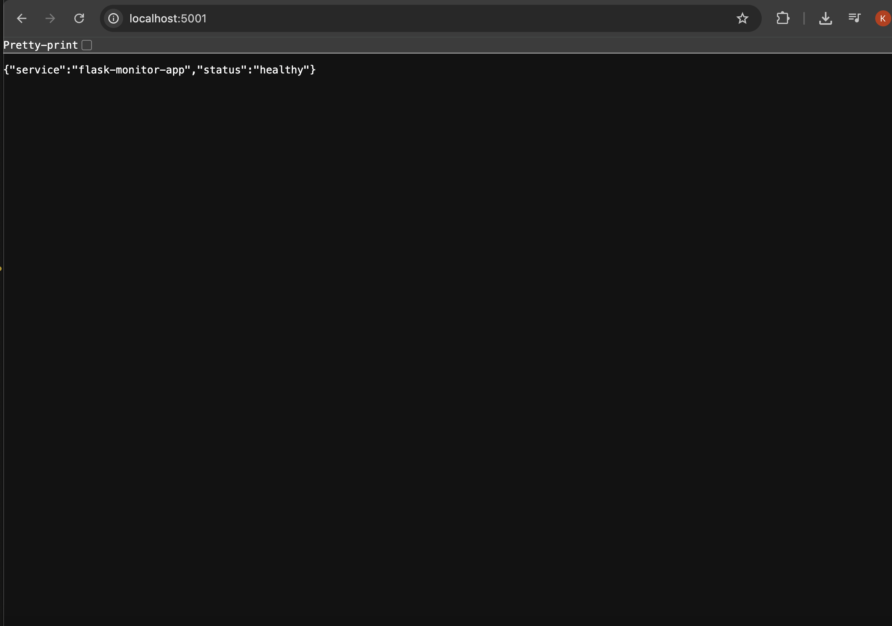

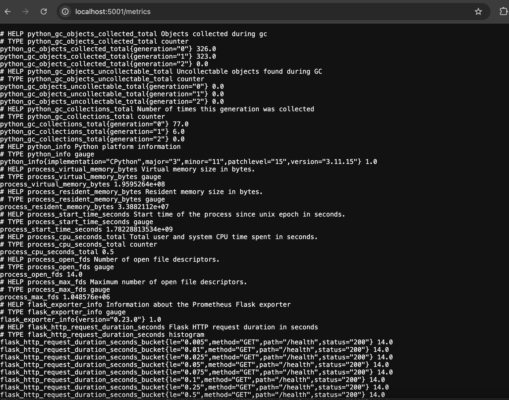

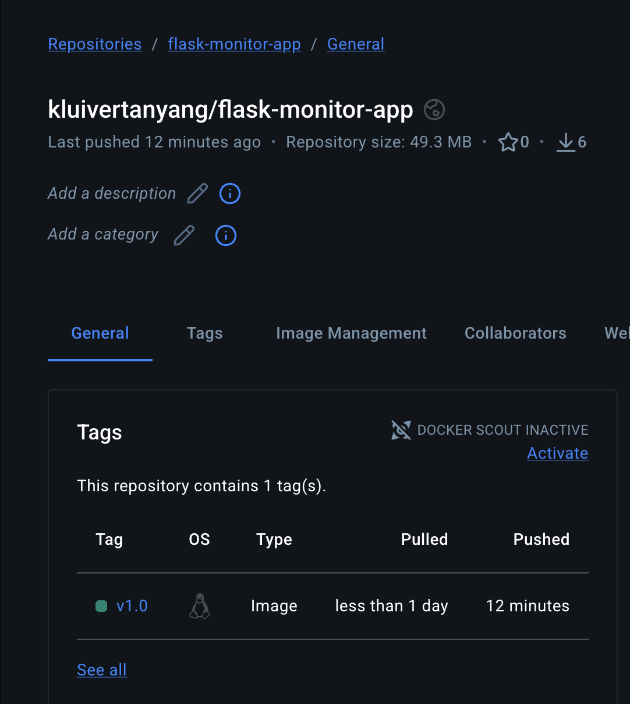

---

## Step 5 — Deploy Flask App to Kubernetes

Create the namespace and deploy the Flask app with 2 replicas:

    kubectl apply -f k8s/namespace.yaml
    kubectl apply -f k8s/flask-deployment.yaml
    kubectl apply -f k8s/flask-service.yaml
    kubectl apply -f k8s/flask-servicemonitor.yaml

Verify both pods are running:

    kubectl get pods -n monitoring

Expected output: both pods show 1/1 Running

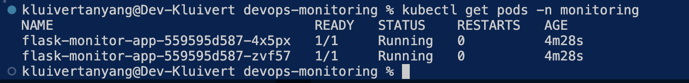

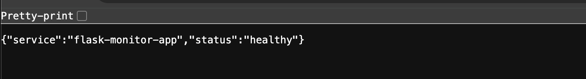

---

## Step 6 — Install Prometheus and Grafana

    helm repo add prometheus-community https://prometheus-community.github.io/helm-charts
    helm repo update
    helm install monitoring prometheus-community/kube-prometheus-stack \
      --namespace monitoring \
      --set grafana.adminPassword=admin123 \
      --set prometheus.prometheusSpec.scrapeInterval=15s

Wait for all pods to be running then access Prometheus:

    kubectl port-forward svc/monitoring-kube-prometheus-prometheus 9090:9090 -n monitoring

Open http://localhost:9090/targets — Flask app shows 2/2 UP:

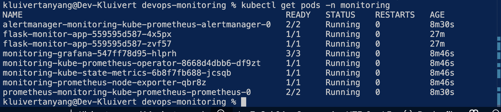

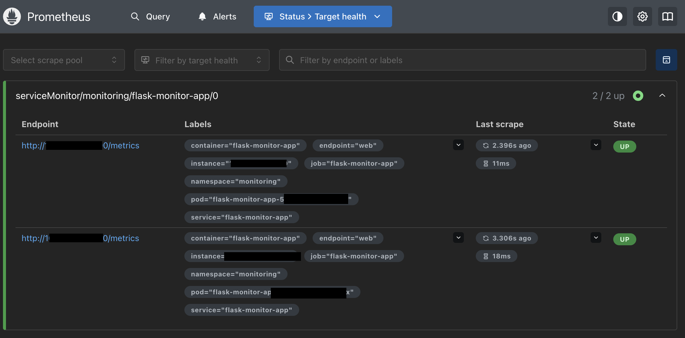

---

## Step 7 — View Grafana Dashboard

    kubectl port-forward svc/monitoring-grafana 3000:80 -n monitoring

Open http://localhost:3000 — login with admin / admin123

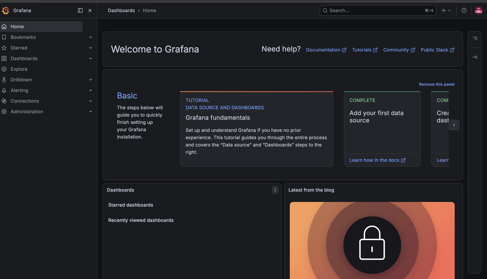

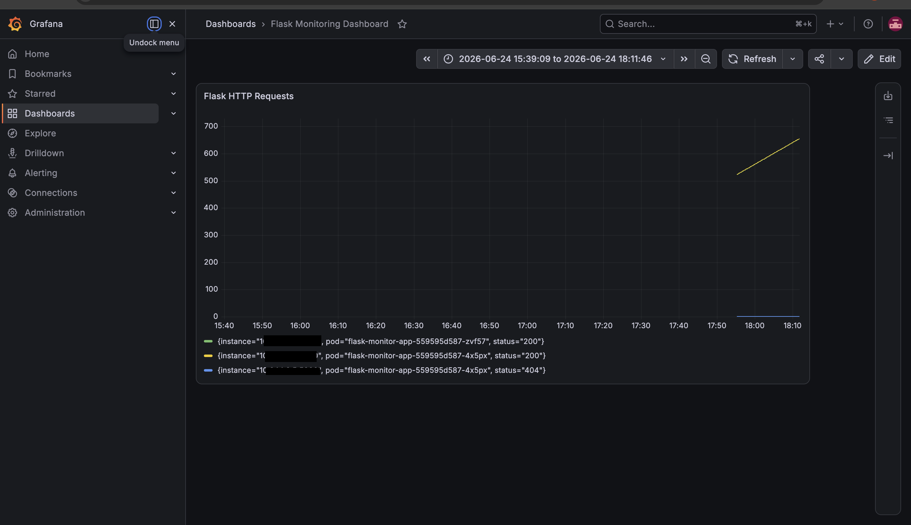

---

## Step 8 — Trigger and View Alerts

Apply alert rules then scale Flask to zero to trigger FlaskAppDown:

    kubectl apply -f k8s/alert-rules.yaml
    kubectl scale deployment flask-monitor-app --replicas=0 -n monitoring

Wait 1 minute and check http://localhost:9090/alerts:

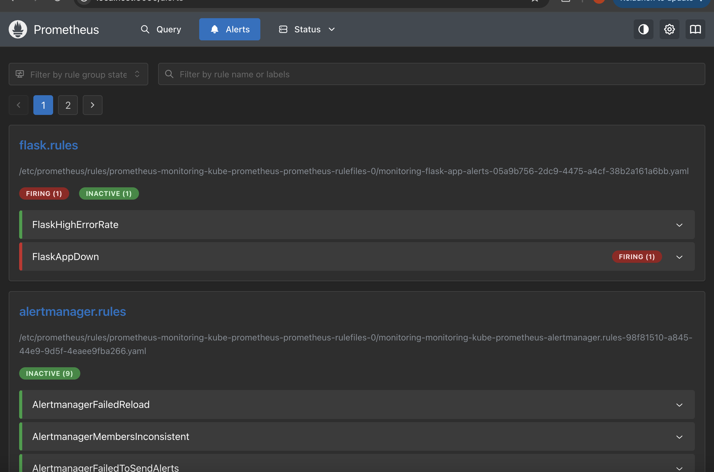

Restore the app:

    kubectl scale deployment flask-monitor-app --replicas=2 -n monitoring

---

## Challenges and Solutions

| Challenge | Solution |
|-----------|---------|
| Port 5000 blocked on Mac M2 | Used port 5001 — Mac reserves 5000 for AirPlay |
| Prometheus not scraping Flask pods | Added ServiceMonitor with release: monitoring label |
| FlaskAppDown alert not firing with up == 0 | Used absent() — metric disappears when pods scale to zero |
| Nested folder appearing in git | Added folder to .gitignore permanently |

## What I Learned

- Prometheus uses a pull model — it scrapes targets rather than receiving pushed metrics
- ServiceMonitor is how Prometheus discovers custom apps in Kubernetes
- The absent() function is more reliable than up == 0 for detecting completely down services
- Docker layer caching speeds up builds — always copy requirements before app code
- Running containers as non-root users is a security best practice
